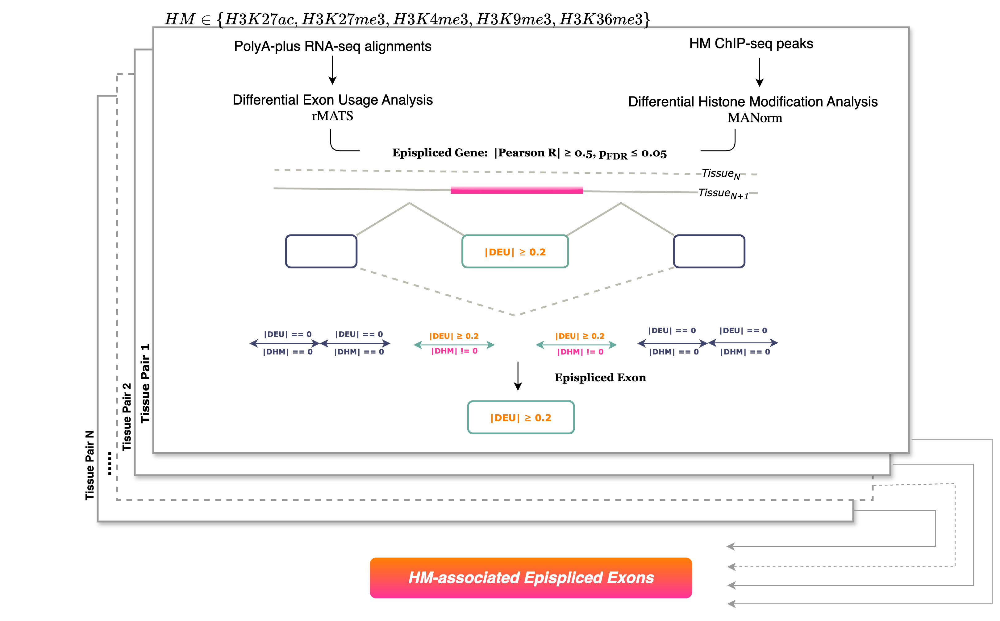

# EpiSplicing Factor Detection Pipeline

This pipeline is used to analyze and connect RNA-seq and histone modification ChIP-seq data in the context of differential exon usage.

## Installations

1. Setup environment

```
$ conda env create -f environment.yml
```


2.  Install [RBPMap](http://rbpmap.technion.ac.il/download.html#requirements)

- Download the required files from http://rbpmap.technion.ac.il/download.html#requirements and follow the installation instructions.
- Copy the perl script `~/EpiSplicing-Factor-Detection-Pipeline/Scripts/HelperFunctions/RBPmap_EpiSplicing.pl` to the RBPmap directory. This will be used as the main RBPmap script.
- In `RBPmap_Episplicing.pl`, edit the paths in the following variables: $scripts_dir, $results_dir to the local *RBPmap* and *EpiSplicing-Factor-Detection-Pipeline* paths, respectively.
- To install the desired genomes: 

*ftp.py*
```python
import os

for i in range(1,23):
	os.system("wget --timestamping 'ftp://hgdownload.cse.ucsc.edu/goldenPath/hg38/chromosomes/chr"+ str(i) + ".fa.gz' -O chr" +str(i) + ".fa.gz")


for x in ['X', 'Y']:
	os.system("wget --timestamping 'ftp://hgdownload.cse.ucsc.edu/goldenPath/hg38/chromosomes/chr"+ x  + ".fa.gz' -O chr" + x + ".fa.gz")

os.system("gunzip -r *.fa.gz")
```
- To convert .fa files to .nib

*allFaToNib.sh*
```shell
for i in *.fa; do
  j="/home/ubuntu/RBPmap_1.2/UCSC/hg38/${i%.*}.nib";
  "../faToNib" "/home/ubuntu/RBPmap_1.2/UCSC/hg38/${i}" "${j}";
  done
```

## Required Files

1. Reference Annotation, Genome: GTF, GFF3 and fasta (gencode)
2.  RNASeq files : .bam and .bam.bai
- Name all the bam and indexed bam files using the following convention:
```
<tissue type>_<identifier>.bam
endodermalcell_ENCFF489LAR.bam
```
3. ChIPSeq Files: .bed
- Helper scripts to download and pre-process alignment and peak files: *./Scripts/PreProcessing/download_and_rename/chipseq_files.py*
- Name all the bed files using the following convention:
```
<histone modification>_<tissue type>_alignment.bed
H3K27ac_ectodermalcell_alignment.bed

<histone modification>_<tissue type>_peak.bed
H3K27ac_ectodermalcell_peak.bed
```
4. Config file: `~/EpiSplicing-Factor-Detection-Pipeline/Scripts/paths.json`

- Fill the fields in paths.json. Example:

```json
    {
    "list_of_processes" : ["pr1", "pr2"],
    "pr1":{
        "tissue1": "ectodermalcell",
        "tissue2": "H1",
        "RNASeq files": "/home/user/data/bam_dir/",
        "Reference GFF3": "/home/user/data/ref_genome/v24/gencode.v24.PRI.gff3",
        "Reference GTF": "/home/user/data/ref_genome/v24/gencode.v24.PRI.gtf",
        "Reference fasta": "/home/user/data/ref_genome/v24/GRCh38.PRI.fa",
                "Histone modifications": [
            "H3K27ac",
            "H3K27me3",
            "H3K9me3",
            "H3K4me3"
        ],
         "ChIPSeq files": "/home/user/data/bam_dir/histone_data/",
        "RBPmap directory": "/home/user/RBPmap_1.2/",
        "Output directory":"", #optional
        "RMATS directory":"/home/user/miniconda3/envs/epi_env/rMATS/"
    },
    "pr2":{
        "tissue1": "endodermalcell",
        "tissue2": "H1",
        "RNASeq files": "/home/user/data/bam_dir/",
        "Reference GFF3": "/home/user/data/ref_genome/v24/gencode.v24.PRI.gff3",
        "Reference GTF": "/home/user/data/ref_genome/v24/gencode.v24.PRI.gtf",
        "Reference fasta": "/home/user/data/ref_genome/v24/GRCh38.PRI.fa",
                "Histone modifications": [
            "H3K27ac",
            "H3K27me3",
            "H3K9me3",
            "H3K4me3",
            "H3K36me3"     
        ],
        "ChIPSeq files": "/home/user/data/bam_dir/histone_data/",
        "RBPmap directory": "/home/user/RBPmap_1.2/",
        "Output directory":"", #optional
        "RMATS directory":"/home/user/miniconda3/envs/epi_env/rMATS/"
    }
    }
```
*Note: If a path to the existing output directory is not specified, a custom output directory will be created using the naming convention: ```../Output/<tissue1>_<tissue2>_timestamp*```. The directory path will be updated in the config file.

## Usage

### TLDR
```bash 
# Run processes(pr*) from config file
# Returns epispliced and non-epispliced genes for every biosample pair
~/EpiSplicing-Factor-Detection-Pipeline/Scripts$ python master_1.py

# Post-processing
# Pools epispliced and non-epispliced genes, run RBPmap, binary classification
~/EpiSplicing-Factor-Detection-Pipeline/Scripts$ python master_2.py <pool/rbpmap/classify/visualize>
```



### Pairwise Differential Analysis
```master_1.py``` triggers the sequential run of the scripts that perform differential analysis of each tissue pair (process) specified in the config file. Specifically, the following scripts:
```
├── 1_RMATS
│   ├── combine_AS_exons.py
│   ├── get_MXE.py
│   ├── get_SE.py
│   └── runRMATS.py
├── 2_MANorm
│   ├── annotate_MANorm_all_exons.py
│   ├── annotate_MANorm_gviz.py
│   ├── combine_all_HMpeaks.py
│   ├── DHM_flanks_RMATS.py
│   └── manorm_all.py
├── 3_Episplicing
│   ├── correlation_plot.py
├── PreProcessing
│   ├── gene_id_to_gene_symbol.R
│   ├── get_exons.sh
│   └── prepare_FlanksRef.py
```
**Output**: For each tissue pair (process) specified in the config file, results are stored in the path under ```Output directory```. The following files can be found:
*    The candidate exons and their flanking regions.
*    The output and intermediate files from RMATS, MANorm.
*    List of epispliced and non-epispliced genes.
*    output.log with log statements from each pipeline script.

### Post-processing
```master_2.py``` needs to be run sequentially with the following arguments:
1. ```pool```
    - Pools +/200bp flanking regions of three exon classes from all the tissue pairs (processes) specified in the config file: epispliced (DEU & DHM), non-epispliced (DEU & !DHM), constitutive exons with DHM annotations (!DEU & DHM).
    - Prepares input for RBPmap.
    - Provides instructions to run RBPmap with user-provided RBPs.
2. ```rbpmap```
    - Runs RBPmap using 132 RBPs from internal database.
3. ```classify```
    - Constructs feature matrix and runs Random forest classifier.
    - Provides instructions to manually select important features from SHAP plots.
4. ```visualize```
    - Creates SHAP plots of important features, binding and correlation heatmaps, boxplots, sequence logos etc.

    
#### Additional Scripts
```Scripts/6_Visualization/visualize_supplement.py``` : MAXENTSCAN, featureCounts etc.

```Scripts/7_Post/*```: bigwig file generation (eCLIP/MAnorm peak read density), PPI analysis
